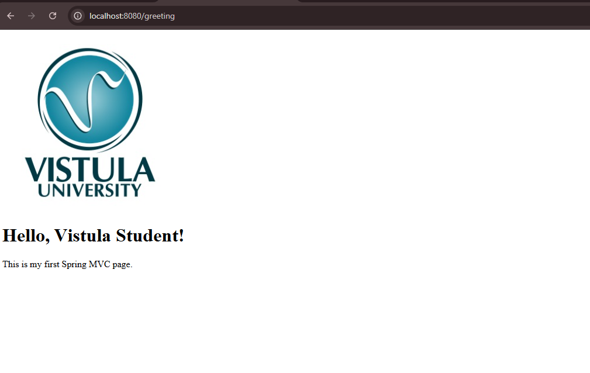

# Spring Framework Apps - Task 1 (First Spring Project)

## Project description
This project is a simple Spring Boot application created from scratch.  
It contains:
- a Spring MVC controller,
- a Thymeleaf view (HTML),
- a static image (PNG).

## Requirements covered
- Spring Boot project created from Spring Initializr
- First controller created
- HTTP request tested in browser (localhost)
- Using MVC (Controller + View) with Thymeleaf
- Static resources served from `/static`

## How to run
1. Open the project in IntelliJ IDEA
2. Make sure Maven dependencies are loaded
3. Run `FirstSpringProjectApplication`
4. Open in browser:
    - `http://localhost:8080/greeting`

## Endpoints / Use cases
### GET /greeting
- Returns the `greeting.html` view
- Passes a model attribute `name = "Vistula Student"` to the view
- Displays an image from `/images/vistula.png`

## Project structure
- Controller: `src/main/java/.../controller/HelloController.java`
- View: `src/main/resources/templates/greeting.html`
- Static image: `src/main/resources/static/images/vistula.png`

## Screenshots

